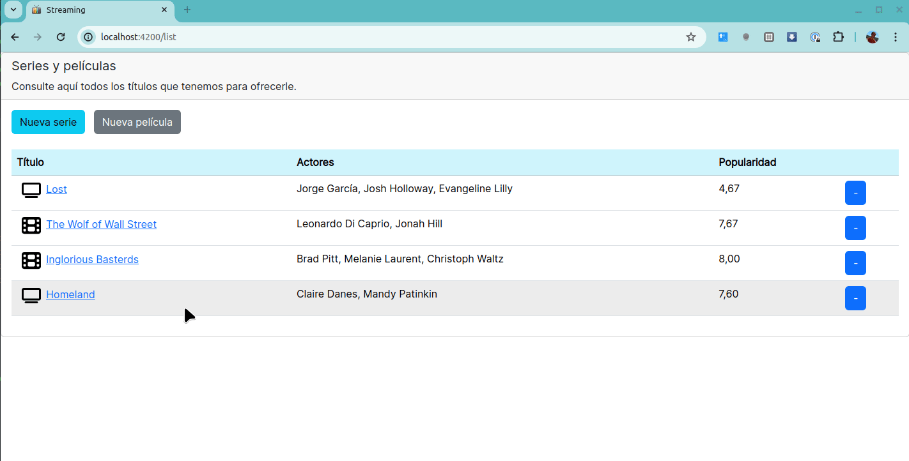
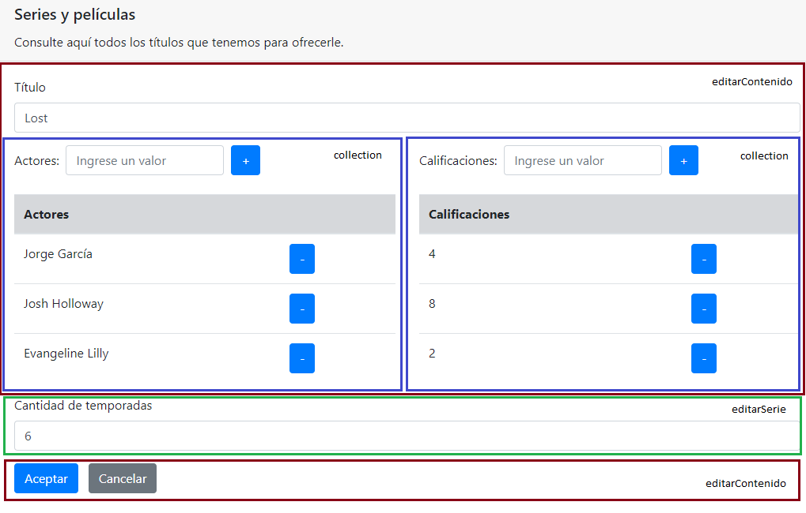

# Streaming - aplicación compleja en Angular

[](https://www.travis-ci.org/uqbar-project/eg-streaming-angular)

Este ejemplo permite mostrar cómo se puede reutilizar componentes visuales y funcionalidades en Angular. 



# Página principal

La página principal es "contenidos", implementado por ContenidosComponent. Aquí mostramos la lista de series y películas que obtenemos de un service local.

```typescript
export class ContenidosComponent implements OnInit {

  contenidos: Contenido[]

  constructor(private contenidoService: ContenidoService, private router: Router) { }
  
  ngOnInit() {
    this.contenidos = this.contenidoService.contenidos
  }
```

El usuario puede eliminar una serie o película, funcionalidad que se delega al service:

```typescript
  eliminar(contenido : Contenido) {
    this.contenidoService.eliminar(contenido)
  }
```

Para crear una serie o una película, pasamos a una ruta específica:

```typescript
  nuevaSerie() {
    this.contenidoService.init()
    this.router.navigate(['edit/serie/new'])
  }

  nuevaPelicula() {
    this.contenidoService.init()
    this.router.navigate(['edit/pelicula/new'])
  }
```

# Routing para embeber componentes padre/hijo

## Definición del ruteo

Tanto la serie como la película comparten

- un identificador
- un título
- la lista de actores
- la lista de calificaciones

pero se diferencian 

- en que la serie sabe la cantidad de temporadas que tiene/tuvo
- mientras que la película tiene una fecha de release o de salida al mercado

Entonces vamos a trabajar con un componente padre: EditarContenidoComponent que va a editar los campos comunes entre serie y película, y además tendremos dos componentes específicos EditarSerieComponent y EditarPeliculaComponent que le agregarán los campos propios de cada entidad.

En el archivo _app-routing.module.ts_ definimos dos hijos para la ruta que edita un contenido:

```typescript
const routes: Routes = [
  { path: '',        redirectTo: '/list', pathMatch: 'full' },
  { path: 'list',    component: ContenidosComponent },
  { path: 'edit',    component: EditarContenidoComponent, children: [
      { path: 'serie/:id', component: EditarSerieComponent },
      { path: 'pelicula/:id', component: EditarPeliculaComponent }
    ] 
  }
]
```

## Link para un contenido nuevo

Hemos visto que el botón "Nueva serie" hace navegar el router de Angular a la URL 'edit/serie/new', esto lo entiende de la siguiente manera:

- el primer path es edit, que se asocia al componente EditarContenido (vista y componente)
- luego el path sigue con la palabra 'serie', que lo asocia al componente EditarSerie
- por último, el parámetro id se asocia al valor 'new', entonces debemos procesarlo dentro del componente para discriminar la creación de la modificación.

## Link para un contenido existente

Para editar una serie, debemos navegar a la URL pasándole el identificador de dicha serie: 'edit/serie/2' por ejemplo. Esto lo hacemos en la vista principal _contenidos.component.html_ de la siguiente manera:

```html
    <a routerLink="/edit/{{contenido.type}}/{{contenido.id}}" routerLinkActive="active">
    {{contenido.titulo}}
    </a>
```

contenido.type es un método del negocio que simplemente devuelve 'serie' o 'pelicula', el identificador ya sabemos qué es.

# Página de edición de una serie

## Vista



La vista que edita la serie (alta o edición) se forma en base a las URL:

- EditarContenidoComponent ingresa los campos título, actores, calificaciones, los botones aceptar y cancelar y un div que muestra los errores de validación del contenido editado
- EditarSerie agrega el campo cantidad de temporadas, y se intercala en la vista que edita el contenido mediante `<router-outlet></router-outlet>`
- a su vez, el EditarContenidoComponent llama a un **componente genérico que permite ingresar colecciones de valores simples: collection.component**: así se cargan los actores como una lista de strings, y las calificaciones como una lista de números. El componente permite agregar o eliminar esa lista en la serie.

Vemos la definición de la vista EditarContenidoComponent:

```html
<form>
  <div class="form-group">
    <label for="titulo">Título</label>
    <input type="text" class="form-control" id="titulo" name="titulo" placeholder="Título del contenido" [(ngModel)]="contenido.titulo">
  </div>
  <div class="row">
    <div class="col-sm">
      <app-collection [container]="contenido" collection="actores" type="text" description="Actores"></app-collection>
    </div>
    <div class="col-sm">
      <app-collection [container]="contenido" collection="calificaciones" type="number" description="Calificaciones"></app-collection>
    </div>
  </div>
  <router-outlet></router-outlet>
  <button type="button" class="btn btn-primary" (click)="guardar()">Aceptar</button>
  &nbsp;
  <button type="button" class="btn btn-secondary" (click)="cancelar()">Cancelar</button>
</form>
<br>
<div class="alert alert-danger animate-repeat" *ngFor="let error of contenido.errors">{{error}}</div>
```

Gracias a todo lo anterior la vista que edita una serie tiene una definición breve:

```html
<div class="form-group">
  <label for="titulo">Cantidad de temporadas</label>
  <input type="text" class="form-control" id="temporadas" name="temporadas" placeholder="Cantidad de temporadas" [(ngModel)]="contenido.temporadas">
</div>
```

## Componentes que forman la edición de una serie

Al editar/crear una serie, debemos tener cuidado de que los dos componentes **apunten al mismo modelo**, de lo contrario no tendremos toda la información de una serie (o una película). La opción recomendada por Angular para hacer esto es [pasar por el service](https://angular.io/guide/component-interaction), por lo que en el evento onInit de cada componente pediremos al service que recupere o cree la información del componente. Vemos cómo se logra esto en el archivo _editarSerie.component.ts_:

```typescript
  ngOnInit() {
    const paramId = this.route.snapshot.params.id
    this.alta = paramId == 'new'
    if (this.alta) {
      this.contenido = this.contenidoService.getOrCreateContenido(this.route.snapshot.url[0].path) 
    } else {
      this.contenido = this.contenidoService.getContenidoById(paramId)
    }
  }
```

El método getOrCreateContenido funciona para el alta, la primera vez crea una serie o una película (en base al path que le pasamos) y lo guarda temporalmente en el service dentro de una variable:

```typescript
// Creamos un mapa antes de la definición de la clase ContenidoService
const tiposContenido = {
  'serie': new Serie(),
  'pelicula': new Pelicula()
}

export class ContenidoService {

  getOrCreateContenido(tipoContenido: string) {
    if (!this.contenido) {
      // En base al string 'serie' busco en el mapa el objeto contenido (una serie) y lo copio
      console.log("contenido", tiposContenido[tipoContenido])
      console.log("que me das", tiposContenido[tipoContenido].copy())
      this.contenido = tiposContenido[tipoContenido].copy()
      this.contenido.id = this.lastId()
    }
    return this.contenido
  }
```

Si ahora se ejecuta el evento onInit del _editarContenido.component.ts_:

```typescript
  ngOnInit() {
    const paramId = this.route.firstChild.snapshot.params.id
    const alta = paramId == 'new'
    if (alta) {
      this.contenido = this.contenidoService.getOrCreateContenido(this.route.firstChild.snapshot.url[0].path)
    } else {
      this.contenido = this.contenidoService.getContenidoById(paramId)
    }
    this.contenidoOld = this.contenido.copy()
  }
```

el getOrCreateContenido devuelve el objeto Serie ya creado (y con un identificador).

Como trabajo futuro queda la posibilidad de unificar las ideas que se repiten en ambos componentes yendo hacia una superclase común.

## Botón Aceptar

El botón Aceptar está definido en EditarContenidoComponent:

```typescript
  guardar(): void {
    this.contenido.validar()
    if (!this.contenido.tieneErrores()) {
      this.contenidoService.actualizar(this.contenido)
      this.navegarAHome()
    }
  }
```

Aquí delegamos a la serie/película la validación de las reglas de negocio, si tiene errores se muestran en la vista en un div específico, y en caso contrario le pedimos al service que actualice el contenido. Por último disparamos la navegación hacia la lista de contenidos.

El método actualizar() del service hace lo siguiente:

```typescript
  actualizar(contenido: Contenido): void {
    if (contenido.existe()) {
      this.eliminar(contenido)
    }
    this.crear(contenido)
  }
```

El método eliminar en realidad busca el elemento por id, no exactamente ese objeto:

```typescript
  eliminar(contenido: Contenido): void {
    const index = this.contenidos.findIndex((elem) => contenido.id == elem.id)
    if (index != -1) {
      this.contenidos.splice(index, 1)
    }
  }
```

Al eliminar y luego crearse nuevamente el contenido, esto produce que el elemento modificado se ubique al final de la lista. Las opciones que dejamos al lector son:

- modificar el método actualizar para reemplazar los valores del contenido nuevo en el elemento que está en la colección en memoria
- ordenar los contenidos de la página principal por id en forma ascendente

## Botón Cancelar

Un último chiche es que si el usuario presiona Cancelar no se actualiza la información. Para eso en el onInit del EditarContenidoComponent estamos guardando una copia del objeto:

```typescript
  ngOnInit() {
    ...
    this.contenidoOld = this.contenido.copy()
  }
```

El método copy() es propio del negocio, hay que tener cuidado con hacer copias con Object.assign() o bien con JSON.stringify() [como se sugiere en algunos sitios](https://stackoverflow.com/questions/728360/how-do-i-correctly-clone-a-javascript-object), ya que esta estrategia

```typescript
copy(): Contenido {
    return Object.assign(this.generateCopy(), this)
}
```

hace una copia superficial (_shallow copy_) por lo tanto las colecciones modificadas se pisan.

Por otra parte esta otra alternativa

```typescript
copy(): Contenido {
    return JSON.parse(JSON.stringify(this))}
}
```

no tiene en cuenta los métodos de Serie o Película (solo copia los atributos, como si fuera un JSON sin comportamiento). La solución es unir ambas propuestas:

- con Object.assign() partimos de un objeto original, con métodos
- mediante el JSON.parse(JSON.stringify(this)) obtenemos una **copia profunda** del objeto, sin que afecte a las colecciones existentes

```typescript
    copy(): Contenido {
        return Object.assign(this.generateCopy(), JSON.parse(JSON.stringify(this)))
    }
```

this.generateCopy() es un **factory method** que devuelve una serie o una película.

Esto "casi siempre" funciona, salvo por las fechas, cuándo no. Hay que usar un pequeño template method como ajuste, copiando a mano la fecha para que no lo reconvierta a string:

```typescript
    // en la clase Contenido
    copy(): Contenido {
        const clone = Object.assign(this.generateCopy(), JSON.parse(JSON.stringify(this)))
        clone.doCopy(this)
        return clone 
    }

    doCopy(contenido: Contenido): void {}

    // en la clase Pelicula
    doCopy(contenido: Contenido): void {
        this.fechaRelease = (contenido as Pelicula).fechaRelease
    }

```

Entonces al cancelar lo que hacemos es actualizar la colección del service con el elemento original:

```typescript
  cancelar(): void {
    if (!this.alta) {
       this.contenidoService.actualizar(this.contenidoOld)
    }
    this.navegarAHome()
  }
```

En el caso de un alta, todavía no fue agregado a la colección por lo que no hacemos nada.
